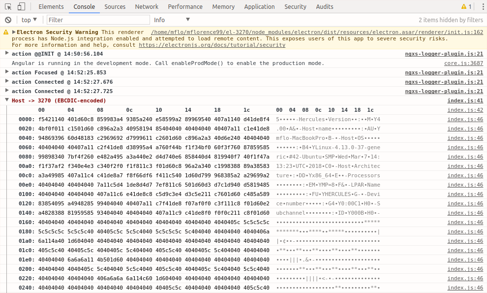

# EL-Lib

EL-Lib is a library of common Angular components, directives, pipes and so on that I use in my Electron projects. I don't expect anyone else will ever use this library as-is but you may find some of its ideas and techniques useful.

<!-- toc -->

- [Installation](#installation)
- [Components](#components)
  * [AnimatedRouterOutletComponent](#animatedrouteroutletcomponent)
  * [DrawerContainerComponent and DrawerPanelComponent](#drawercontainercomponent-and-drawerpanelcomponent)
  * [Markdown Component](#markdown-component)
- [Directives](#directives)
- [Pipes](#pipes)
- [Decorators](#decorators)
  * [@AutoUnsubscribe](#autounsubscribe)
  * [@OnChange](#onchange)
- [Animations](#animations)
  * [inOutAnimation](#inoutanimation)
  * [showHideAnimation](#showhideanimation)
  * [routeAnimation](#routeanimation)
- [Utilities](#utilities)
  * [API Summary](#api-summary)
  * [debounce](#debounce)
  * [dump](#dump)
  * [nextTick](#nexttick)

<!-- tocstop -->

## Installation

Just in case ...

```sh
npm install --save ellib
```

## Components

```typescript
import { LibModule } from 'ellib';

@NgModule({
  imports: [LibModule]
})
```

### AnimatedRouterOutletComponent

Just use in place of `<router-outlet>` for a slide-in effect on route transitions.

```html
  <lib-animated-router-outlet>
  </lib-animated-router-outlet>
```

### DrawerContainerComponent and DrawerPanelComponent

Wrap content so that drawers of related content slide out on command from the top, right, bottom and/or left. The drawers are modal. Examples might be filters, preferences, CRUD support and the like.

```html
<lib-drawer-container>

  <my-toolbar
    (showPrefs)="prefsDrawer.open()">
  </my-toolbar>
  ...
  <lib-drawer-panel
    #prefsDrawer
    position="right">
    ...
  </lib-drawer-panel>

</lib-drawer-container>
```

### Markdown Component

Wrap arbitrary markdown, which will be converted to HTML as the component loads.

```html
<lib-markdown>
# Hello, World!
</lib-markdown>  
```

Requires [`marked`](https://www.npmjs.com/package/marked) which might be loaded via `.angular-cli.json`.

```json
"scripts": [
  "../node_modules/marked/marked.min.js"
],
```

## Directives

## Pipes

## Decorators

### @AutoUnsubscribe

Annotates a components so that any RxJS subscriptions are automatically unsubscribed when the component is destroyed.

```typescript
import { AutoUnsubscribe } from 'ellib';
import { LifecycleComponent } from 'ellib';

@Component({...})
@AutoUnsubscribe()
export class MyComponent extends LifecycleComponent {

  private mySubscription: Subscription;
  private anotherSubscription: Subscription;

  constructor(...) {
    super();
    // sadly if you have a ctor you have to remember to call super!
  }

  // if non null when the component is destroyed, both will be unsubscribed
  // automatically -- no other action needed

}

```

### @OnChange

Greatly simplifies `ngOnChanges` handling for `@Input()` fields, and is especially useful when those fields are supplied via the `async` pipe and you need to know when they've changed.

```typescript
import { OnChange } from 'ellib';
import { LifecycleComponent } from 'ellib';

@Component({...})
export class MyComponent extends LifecycleComponent {

  @Input() a;
  @Input() b;

  constructor(...) {
    super();
    // sadly if you have a ctor you have to remember to call super!
  }

  @OnChange('a', 'b')
  myChanges(changedA: boolean, changedB: boolean) {
    // the name of this method is arbitrary
    // if multiple fields are coded, then it is called if EITHER changes
    // a boolean is passed for each so you can tell what changed
    if (this.a && this.changedA) { ... }
  }

}

```

## Animations

It took me ages to get these right. Maybe I'm not so smart as I think! I do know that I hate DSLs. I think they're all a fraud. They pretend to be intuitive but there's no way to discern the API without examples, so I offer mine as models to use, discard or improve on.

### inOutAnimation

Animates the changing contents of a container by fading in the new and fading out the old.

```typescript
import { inOutAnimation } from 'ellib';

@Component({
  animations: [inOutAnimation()],
  ...
})
```

```html
<div [@inOut]="... expression that identifies contents ...">
  ...
</div>
```

### showHideAnimation

Shows the contents of a container by expanding it height to fit; hides the contents by shrinking its height to zero.

```typescript
import { showHideAnimation } from 'ellib';

@Component({
  animations: [showHideAnimation()],
  ...
})
```

```html
<div [@showHide]="expertMode? 'shown' : 'hidden'">
  ...
</div>
```

### routeAnimation

Designed to be used by the `AnimatedRouterOutletComponent` as described above. It slides the contents of the old route out to the right, and the new in from the left.

## Utilities

### API Summary

```typescript
export declare function debounce(func: Function, wait?: number, immediate?: boolean): Function;
export declare function deepCopy<T>(obj: T): T;
export declare function dump(data: Uint8Array, title: string, ebcdic?: boolean, color?: string): void;
export declare function isObjectEmpty(obj: any): boolean;
export declare function nextTick(f: Function): void;
export declare function reverseMap(obj: any): any;
export declare function toHex(num: number, pad: number): string;
```

### debounce

Very useful when you want to debounce but using `Observable` is impossible or inconvenient.

```typescript
import { debounce } from 'ellib';

setup: Function;

this.setup = debounce((...) => {
  ...
}, 250);
```

### dump

Produces a nice, expandable dump of large objects (like Buffers) to the console.



### nextTick

A semantic recasting of `setTimeout(..., 0)` when used (for example) In Angular to force rendering.

```typescript
import { nextTick } from 'ellib';

nextTick((...) => {
  ...
});
```
